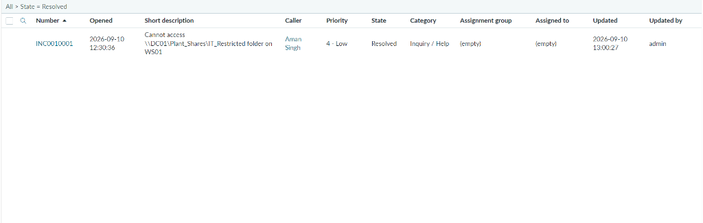
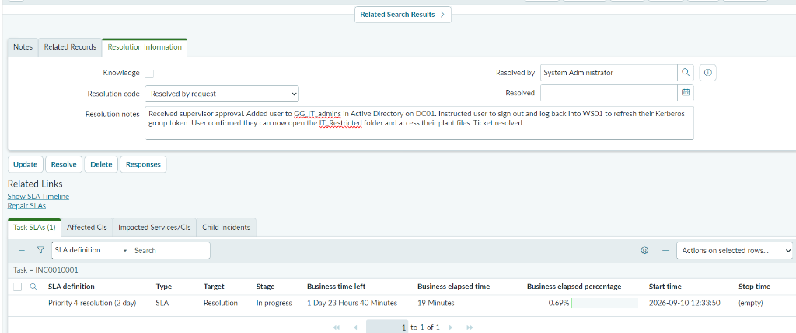
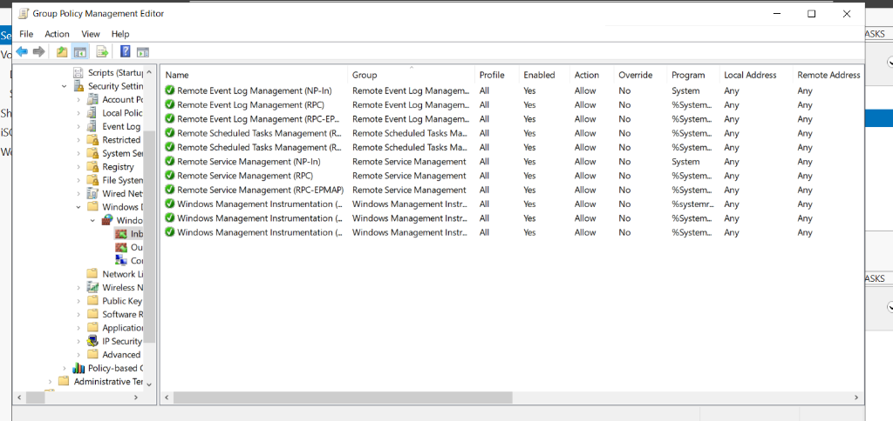
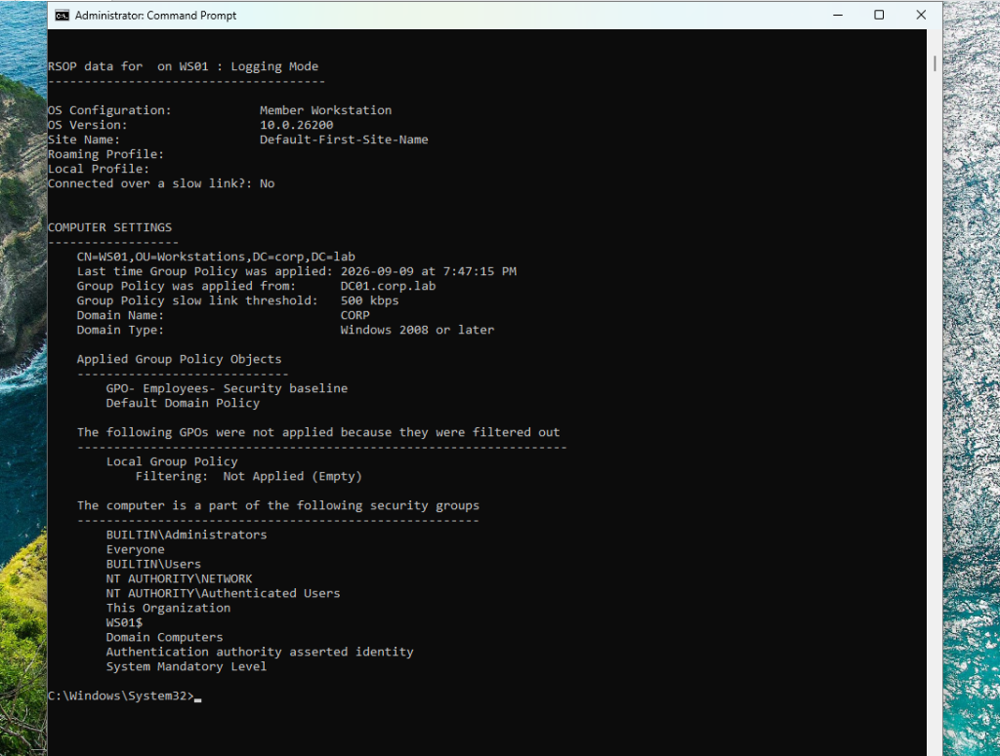
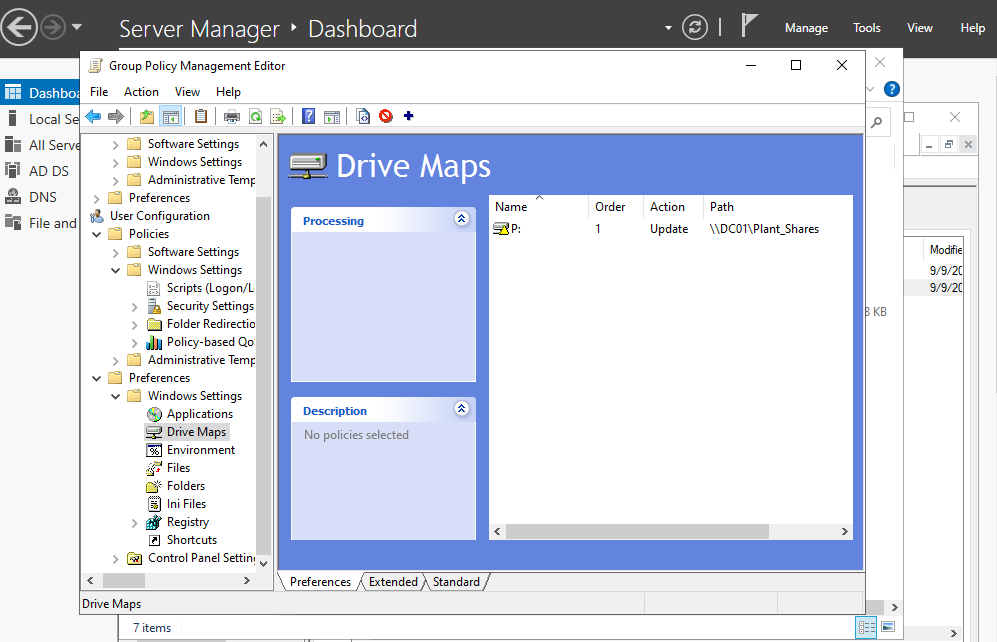
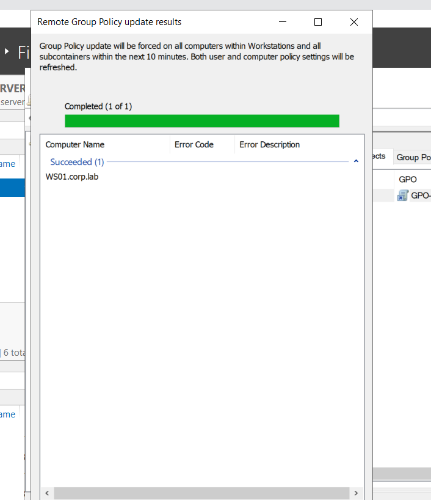

# Enterprise Windows Server, Active Directory & ServiceNow ITSM Lab

A hands-on enterprise infrastructure homelab built in VMware Workstation, simulating the onsite IT support operations of a manufacturing plant environment (**Westlake Corporation**). 

This project documents the end-to-end deployment of an Active Directory Domain Services environment, Group Policy security baselines, role-based network file sharing, remote endpoint orchestration, and **live incident lifecycle management using cloud-hosted ServiceNow**.

---

## 🖥️ Network & Infrastructure Architecture

| System / Host | Operating System | Role | IP Address / Location | Functions |
| :--- | :--- | :--- | :--- | :--- |
| **DC01** | Windows Server 2022 | Primary Domain Controller | `192.168.105.129` (Static) | AD DS, DNS (`corp.lab`), File Server (`\\DC01\Plant_Shares`), GPO Management |
| **WS01** | Windows 11 Pro x64 | Plant Workstation | `192.168.105.x` (DHCP) | Domain Client, Mapped Drive `P:\`, Endpoint Logging, WinRM Remote Target |
| **ServiceNow** | Cloud SaaS | ITSM Platform | `https://dev427065.service-now.com` | Live Incident Intake, SLA Tracking, ITIL Work Notes, Resolution |

```mermaid
graph TD
    subgraph OnPrem ["On-Premises Infrastructure (VMware Virtual Network - 192.168.105.0/24)"]
        DC01["DC01.corp.lab (Windows Server 2022)<br/>• Active Directory DS & DNS<br/>• Centralized GPO Management<br/>• Plant File Share (\\DC01\\Plant_Shares)"]
        WS01["WS01.corp.lab (Windows 11 Client)<br/>• Domain-Joined Client<br/>• Auto-Mapped Drive (P:)<br/>• WinRM Remote Target"]

        DC01 <-->|Kerberos Auth (Port 88) / LDAP / SMB (Port 445)| WS01
        DC01 -->|Remote Management (WinRM 5985 / RPC 135)| WS01
    end

    subgraph Cloud ["Enterprise Cloud ITSM"]
        SN["ServiceNow Instance (dev427065)<br/>• Incident INC0010001<br/>• SLA Tracking & Work Notes"]
    end

    Tech["Tier 2 Technician (Aman Singh)"] -->|Administers & Troubleshoots| DC01
    Tech -->|Remotely Manages & Queries| WS01
    Tech -->|Triages & Resolves Incidents| SN
```

---

## 🎫 Live ServiceNow Incident Management (ITIL)

Rather than just simulating tickets in text, this lab integrates a live cloud **ServiceNow instance** (`https://dev427065.service-now.com`) to manage real plant support tickets from intake to resolution:



### Incident Breakdown: `INC0010001`
* **Caller:** Aman Singh (Plant Operations / Maintenance)
* **Category:** Inquiry / Help
* **Short Description:** `Cannot access \\DC01\Plant_Shares\IT_Restricted folder on WS01`
* **State:** **Resolved** (Target SLA: Priority 4 - 2 Business Days)



### The Triage & Resolution Process:
1. **Diagnosis:** Investigated user account in Active Directory Users & Computers on DC01. Confirmed the user was a member of `GG_EMPLOYEES`, but was missing membership in `GG_IT_admins`. Verified that NTFS permissions on `\\DC01\Plant_Shares\IT_Restricted` had inheritance disabled and was restricted strictly to the IT admin group.
2. **Security Compliance:** Did not grant individual folder permissions. Requested Plant Supervisor approval for maintenance shift access following least-privilege principles.
3. **Remediation:** Added `CORP\apsingh` to `GG_IT_admins` in AD DS on DC01. Instructed the user to sign out and log back into WS01 to regenerate their Kerberos token with the updated group SID. Verified access was restored and closed the ticket.

---

## 🔒 Group Policy Security Baseline & Centralized Firewall Orchestration

To harden client endpoints against unauthorized lateral movement while still allowing IT administrators to manage workstations remotely, a custom **Security Baseline GPO** (`GPO- Employees- Security baseline`) was configured on DC01 and linked to the `Workstations` OU:

### 1. Centralized Inbound Firewall Rules
Windows Defender Firewall was configured with default inbound drops, with explicit management exceptions pushed centrally via GPO:



* **Remote Event Log Management (RPC / EPMAP / NP):** Allows remote log inspection from DC01.
* **Remote Service Management (RPC / EPMAP / NP):** Allows starting, stopping, and restarting background services remotely.
* **Remote Scheduled Tasks Management (RPC / EPMAP):** Required for remote Group Policy updates.
* **Windows Management Instrumentation (WMI / DCOM):** Allows remote queries and management instrumentation.

### 2. User Rights Assignment
* **Allow log on locally:** Enforced via GPO to restrict physical interactive console access to authorized administrative and employee groups (`Administrators`, `GG_IT_admins`, `GG_EMPLOYEES`, `Domain Users`).

### 3. Policy Enforcement on the Client
Policy application was verified on `WS01` using an elevated `gpresult /scope computer /r`:



---

## 📂 Departmental File Sharing & Automated GPO Drive Mapping

To eliminate messy login scripts and manual technician mapping, a centralized network repository was built on DC01 and auto-mapped to all employee endpoints via **Group Policy Preferences (GPP)**:



### Share & NTFS Permission Architecture:
* **Parent Share:** `C:\Plant_Shares` shared over SMB as `\\DC01\Plant_Shares` (Share Permissions: `Authenticated Users` = Change & Read).
* **`\Shipping_Logistics`:** NTFS: `GG_EMPLOYEES` = Modify, `Domain Admins` = Full Control.
* **`\Plant_Operations`:** NTFS: `GG_EMPLOYEES` = Read & Execute, `GG_IT_admins` = Modify.
* **`\IT_Restricted`:** NTFS: **Inheritance Disabled**. Generic `Users` group removed. Only `GG_IT_admins` granted Modify access.
* **Drive Letter:** Enforced drive letter **`P:\`** mapping with automatic reconnection upon user logon.

---

## ⚡ Remote Administration & Orchestration

### 1. Remote Group Policy Updates (From DC01)
Instead of manually running `gpupdate /force` across individual plant workstations, updates are pushed remotely from DC01 across the `Workstations` OU using GPMC and PowerShell:



```powershell
# Remote Group Policy push from DC01:
Invoke-GPUpdate -Computer WS01 -Force
```

### 2. Remote Storage & Volume Diagnostics (CIM / WinRM)
Remote storage health is queried directly over WinRM port 5985 without relying on legacy MMC snap-ins:

```powershell
Get-Volume -CimSession WS01
```

```
DriveLetter  FileSystemType  HealthStatus  SizeRemaining      Size  PSComputerName
-----------  --------------  ------------  -------------      ----  --------------
C            NTFS            Healthy            39.02 GB  63.02 GB  WS01
D            Unknown         Healthy                 0 B   7.89 GB  WS01
```

---

## 🛠️ Real-World Troubleshooting Case Studies

### 1. The MS16-072 GPO Security Filtering Gotcha
* **Problem:** Newly linked security baseline GPO was completely missing from `gpresult` on `WS01`.
* **Root Cause:** In modern Windows, machine policies are retrieved by the computer identity (`WS01$`), which belongs to `Domain Computers`. Security filtering was originally restricted to a user group (`GG_EMPLOYEES`), preventing the computer account from reading the GPO from `SYSVOL`.
* **Fix:** Added `Domain Computers` to the GPO's Security Filtering list with Read & Apply rights.

### 2. Remote GPUpdate RPC Cancellation (Error 8007071a)
* **Problem:** Remote GPUpdate from DC01 failed with error `8007071a: The remote procedure call was cancelled`.
* **Root Cause:** Client-side firewall on `WS01` was blocking inbound RPC and Scheduled Task ports used by DC01 to schedule the update.
* **Fix:** Added predefined inbound rules for *Remote Scheduled Tasks Management* and *WMI* in the baseline GPO. Once pulled, remote updates succeeded with a 100% green bar.

### 3. Windows 11 OOBE Network Requirement Bypass
* **Problem:** Clean Windows 11 installation halted at Out-of-Box Experience (OOBE) forcing a personal Microsoft Account with no option for a local domain join account.
* **Fix:** Opened console using `Shift + F10`, ran `cd oobe` followed by `bypassnro.cmd`, allowing limited offline setup to create a clean local administrator prior to domain joining.

---

## 📜 PowerShell Support Scripts

This repository includes practical scripts used for daily administration:
* [`Export-ITHealthTelemetry.ps1`](scripts/Export-ITHealthTelemetry.ps1): Collects locked accounts, inactive users (>90 days), and Event ID 4625 logs into structured JSON for health audits and AI analysis.
* [`New-PlantEmployee.ps1`](scripts/New-PlantEmployee.ps1): Automates employee provisioning with standardized username format, OU placement, and default security group assignment.

---

## 👨‍💼 Author
* **Aman Singh**
* **Focus:** Tier 1 / Tier 2 IT Support • Desktop Administration • Junior Infrastructure
* **Certifications / Background:** Networking Diploma, AZ-900 (Certified), AZ-104 (In Progress)
