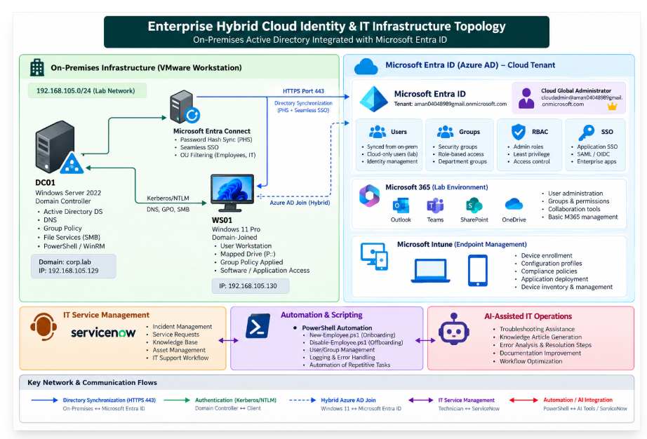
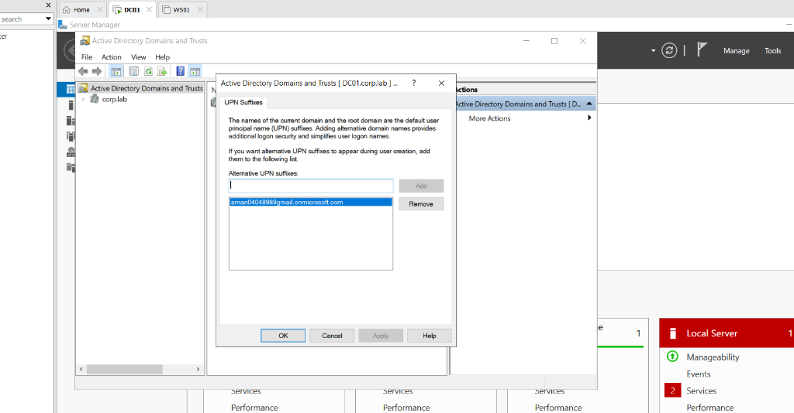
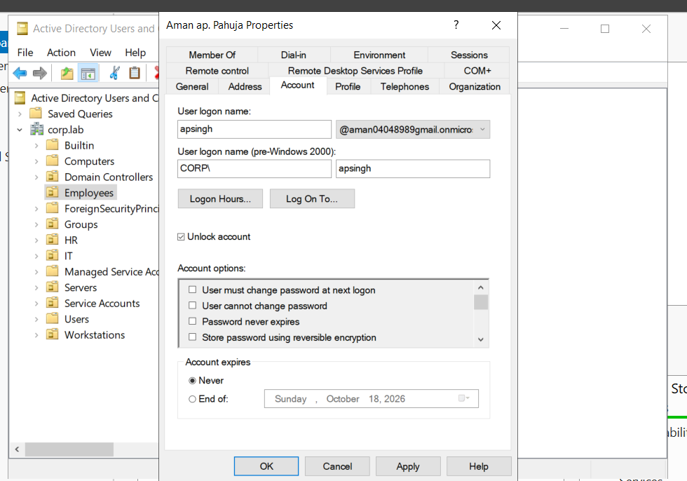
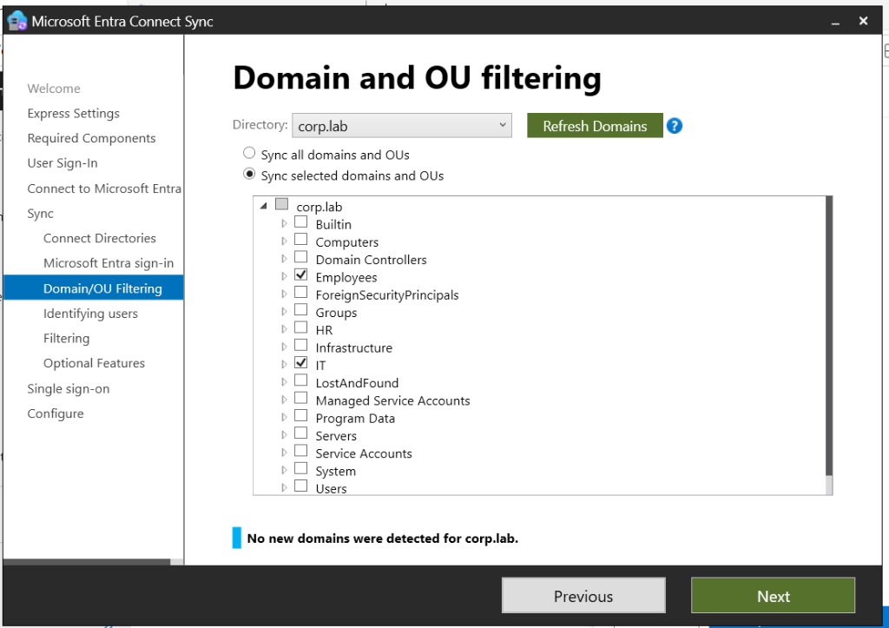
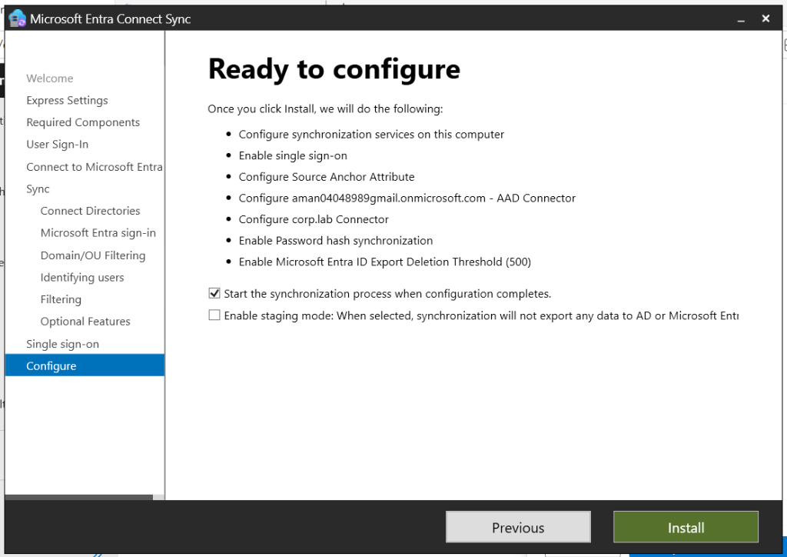
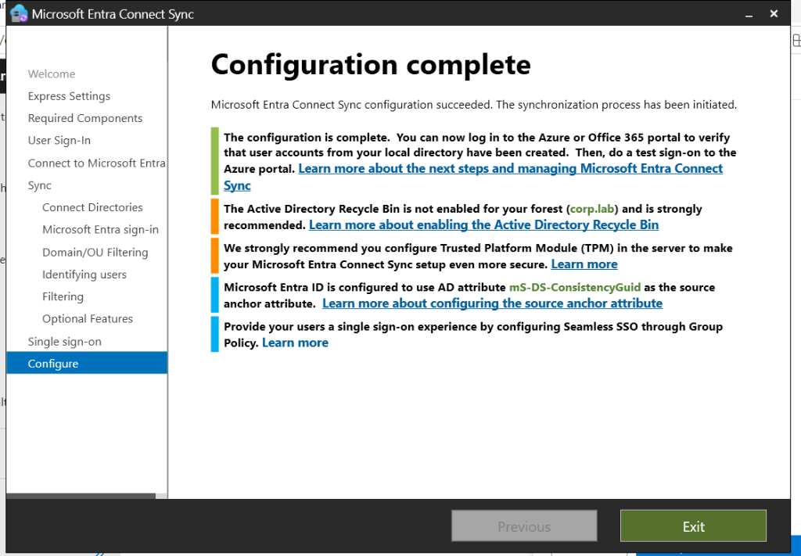
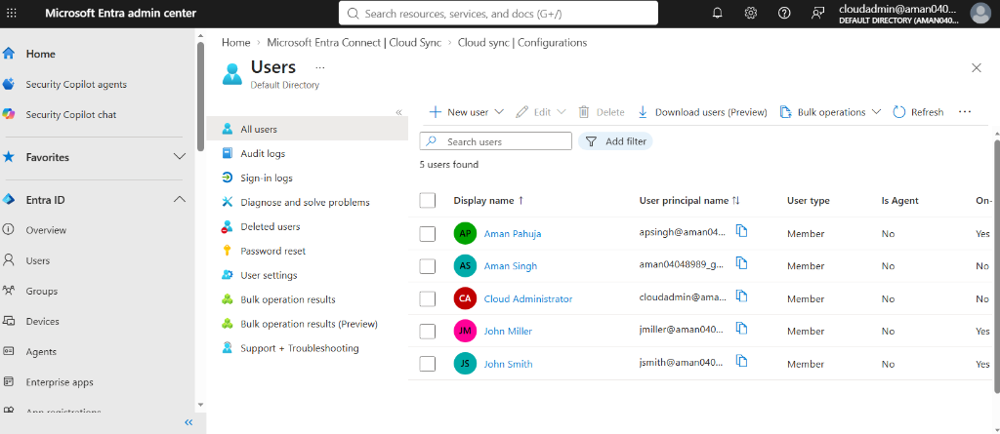
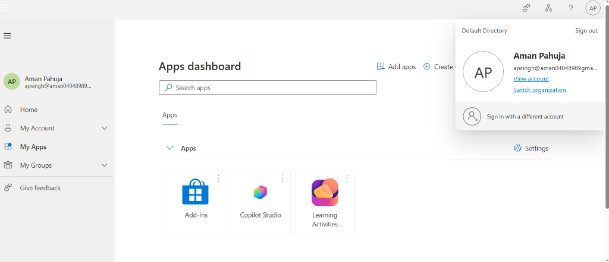

# Lab 2: Enterprise Hybrid Identity & Microsoft Entra ID Sync

## 🎯 Objective
Extend the on-premises Active Directory Domain Services infrastructure (`corp.lab`) into a modern **Hybrid Cloud Identity** architecture by synchronizing directory objects, security groups, and password hashes with a live **Microsoft Entra ID (formerly Azure AD)** tenant.

---

## 🏛️ Topology & Cloud Prerequisites

* **On-Premises Hypervisor:** VMware Workstation (Subnet: `192.168.105.0/24`)
* **Domain Controller (DC01):** Windows Server 2022 Standard (`192.168.105.129`), Active Directory Domain Services, DNS (`corp.lab`)
* **Client Workstation (WS01):** Windows 11 Pro x64 (`192.168.105.130`), Domain-Joined
* **Cloud Tenant:** Microsoft Entra ID Free
  * **Primary Cloud Domain:** `aman04048989gmail.onmicrosoft.com`
  * **Tenant ID:** `5541e0cd-39eb-48f5-a815-14c6b99436a6`
  * **Dedicated Cloud Admin:** `cloudadmin@aman04048989gmail.onmicrosoft.com` (Global Administrator)

---

## 🛠️ Implementation Progress

### Milestone 1: Alternative UPN Suffix Configuration
* **Challenge:** The on-premises forest uses a non-routable top-level domain (`.lab`). Public cloud identity services cannot route or federate non-routable domains, which would cause Entra ID to assign unexpected fallback routing aliases (`@*.onmicrosoft.com`).
* **Implementation:** Configured `aman04048989gmail.onmicrosoft.com` as an Alternative User Principal Name (UPN) suffix in **Active Directory Domains and Trusts** on `DC01`.
* **Verification:** Verified that the custom UPN suffix is globally available across the forest schema for user object assignment.

---

### Milestone 2: User Identity UPN Alignment
* **Implementation:** Updated the target production user account (`CORP\apsingh` - Aman Singh / Aman Pahuja) within `OU=Employees,DC=corp,DC=lab` using Active Directory Users and Computers (ADUC).
* **Configuration:** Replaced the legacy logon suffix `@corp.lab` with the cloud-routable UPN `@aman04048989gmail.onmicrosoft.com`.
* **Result:** User identity is aligned with the cloud tenant namespace prior to directory synchronization, ensuring clean identity matching and single-identity logon.

---

### Milestone 3: Microsoft Entra Connect Custom Deployment & Targeted OU Filtering
* **Architecture Decision:** Rejected Express Settings to avoid synchronizing local machine accounts, service accounts, and built-in administrative objects.
* **Sign-In Method:** Configured **Password Hash Synchronization (PHS)** as the primary identity method and enabled **Seamless Single Sign-On (Seamless SSO)** for corporate domain clients.
* **OU Filtering:** Enforced granular filtering under `corp.lab`, synchronizing **only** designated production containers:
  * `OU=Employees,DC=corp,DC=lab`
  * `OU=IT,DC=corp,DC=lab`

* **Pre-Flight Validation:** Reviewed configuration parameters before initiating directory export:

---

### Milestone 4: Synchronization Execution & Cloud Verification
* **Sync Engine Execution:** Executed the initial full export cycle via Microsoft Entra Connect Sync.
* **Engine Completion:** Verified that directory synchronization services initialized and completed with zero sync engine errors.

* **Cloud Verification:** Inspected the **Microsoft Entra admin center** (`entra.microsoft.com`) under `Users > All users`.
* **Telemetry Proof:**
  * Synchronized identities (`Aman Pahuja`, `John Miller`, `John Smith`) are actively populated.
  * Verified column attribute: **`On-premises sync enabled: Yes`**.
  * Cloud-only administrative identities (`Cloud Administrator`) correctly remain isolated (`On-premises sync enabled: No`).

---

### Milestone 5: Password Hash Synchronization (PHS) Authentication Validation
* **Verification:** Performed end-to-end cloud authentication test at `https://myapps.microsoft.com` using the synchronized on-premises Active Directory password credentials.
* **Troubleshooting Handled:** Resolved initial hash synchronization queue delay by performing an AD password event and triggering an incremental delta sync (`Start-ADSyncSyncCycle -PolicyType Delta`). Documented in [Case Study 05](../troubleshooting/05_password_hash_sync_authentication.md).
* **Result:** User successfully authenticated and landed on the My Apps enterprise dashboard under active tenant session context.

---

### ⏳ Current Status: Milestone 6 (In Progress)
* **Next Task:** Seamless Single Sign-On (Seamless SSO) client validation from domain-joined client `WS01`.
