# Lab 2: Enterprise Hybrid Identity & Microsoft Entra ID Sync

## 🎯 Objective
Extend the on-premises Active Directory Domain Services infrastructure (`corp.lab`) into a modern **Hybrid Cloud Identity** architecture by synchronizing directory objects, security groups, and password hashes with a live **Microsoft Entra ID (formerly Azure AD)** tenant, and validating **Seamless Single Sign-On (SSO)** on domain endpoints.

---

## 🏛️ Topology & Cloud Prerequisites

* **On-Premises Hypervisor:** VMware Workstation (Subnet: `192.168.105.0/24`)
* **Domain Controller (DC01):** Windows Server 2022 Standard (`192.168.105.129`), Active Directory Domain Services, DNS (`corp.lab`)
* **Client Workstation (WS01):** Windows 11 Pro x64 (`192.168.105.130`), Domain-Joined
* **Cloud Tenant:** Microsoft Entra ID Free
  * **Primary Cloud Domain:** `aman04048989gmail.onmicrosoft.com`
  * **Tenant ID:** `5541e0cd-39eb-48f5-a815-14c6b99436a6`
  * **Dedicated Cloud Admin:** `cloudadmin@aman04048989gmail.onmicrosoft.com` (Global Administrator)

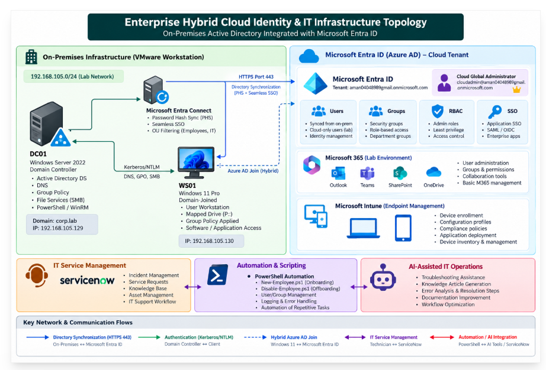

---

## 🛠️ Implementation & Evidence Milestones

### Milestone 1: Alternative UPN Suffix Configuration
* **Challenge:** The on-premises forest uses a non-routable top-level domain (`.lab`). Public cloud identity services cannot route or federate non-routable domains, which would cause Entra ID to assign unexpected fallback routing aliases (`@*.onmicrosoft.com`).
* **Implementation:** Configured `aman04048989gmail.onmicrosoft.com` as an Alternative User Principal Name (UPN) suffix in **Active Directory Domains and Trusts** on `DC01`.
* **Verification:** Verified that the custom UPN suffix is globally available across the forest schema for user object assignment.

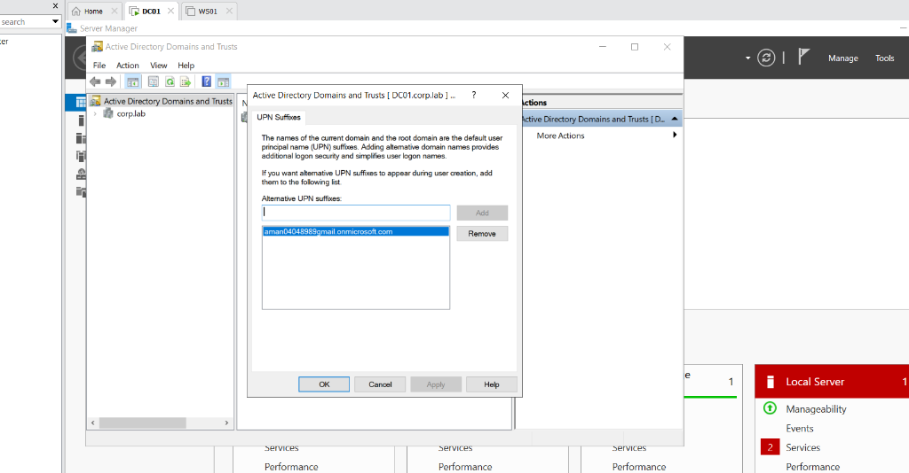

---

### Milestone 2: User Identity UPN Alignment
* **Implementation:** Updated the target production user account (`CORP\apsingh` - Aman Singh / Aman Pahuja) within `OU=Employees,DC=corp,DC=lab` using Active Directory Users and Computers (ADUC).
* **Configuration:** Replaced the legacy logon suffix `@corp.lab` with the cloud-routable UPN `@aman04048989gmail.onmicrosoft.com`.
* **Result:** User identity is aligned with the cloud tenant namespace prior to directory synchronization, ensuring clean identity matching and single-identity logon.

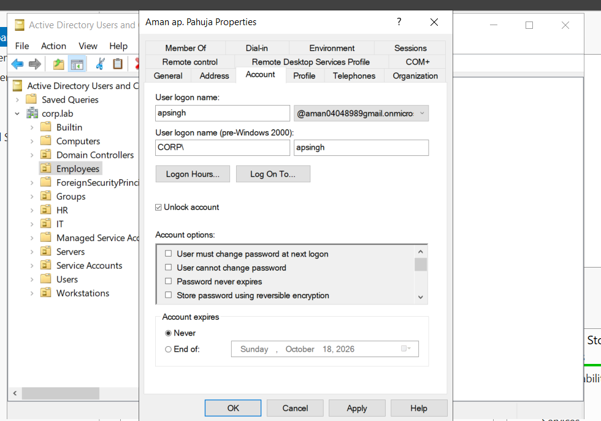

---

### Milestone 3: Microsoft Entra Connect Custom Deployment & Targeted OU Filtering
* **Architecture Decision:** Rejected Express Settings to avoid synchronizing local machine accounts, service accounts, and built-in administrative objects.
* **Sign-In Method:** Configured **Password Hash Synchronization (PHS)** as the primary identity method and enabled **Seamless Single Sign-On (Seamless SSO)** for corporate domain clients.
* **OU Filtering:** Enforced granular filtering under `corp.lab`, synchronizing **only** designated production containers:
  * `OU=Employees,DC=corp,DC=lab`
  * `OU=IT,DC=corp,DC=lab`

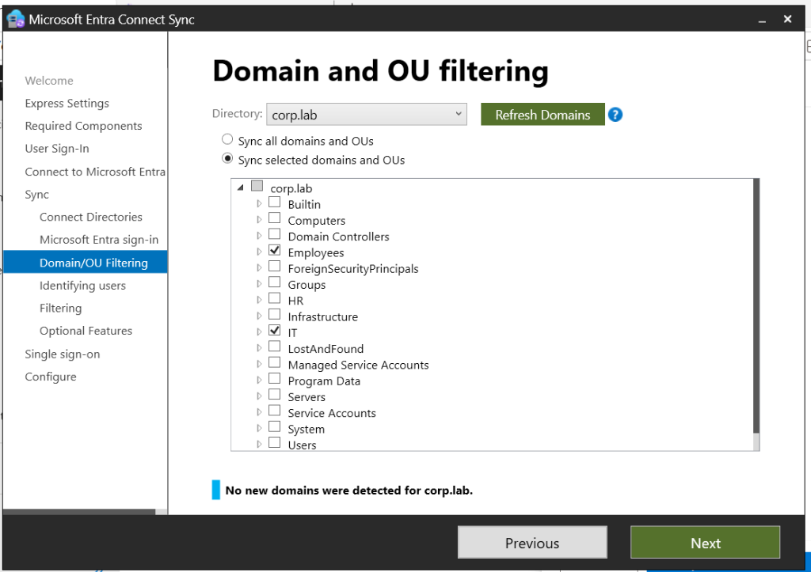

* **Pre-Flight Validation:** Reviewed configuration parameters before initiating directory export:

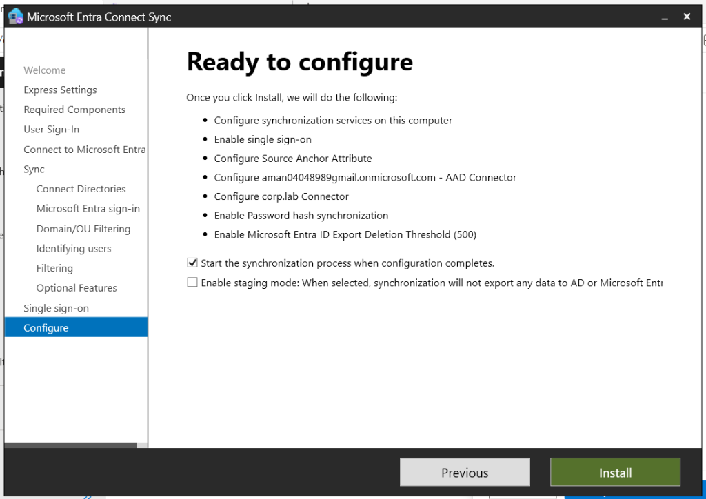

---

### Milestone 4: Synchronization Execution & Cloud Verification
* **Sync Engine Execution:** Executed the initial full export cycle via Microsoft Entra Connect Sync.
* **Engine Completion:** Verified that directory synchronization services initialized and completed with zero sync engine errors.

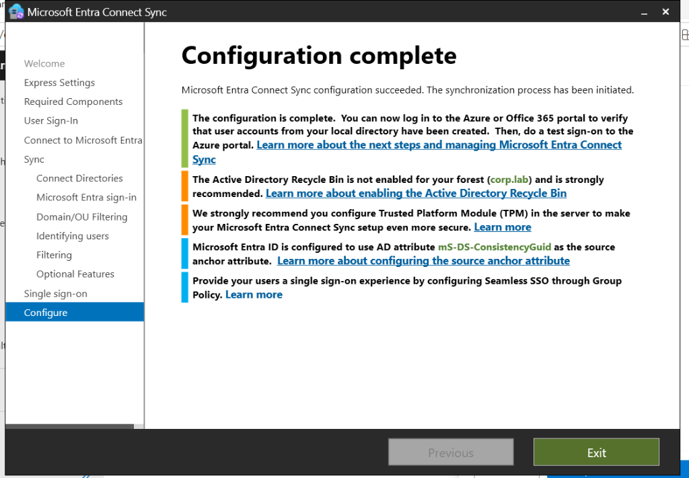

* **Cloud Verification:** Inspected the **Microsoft Entra admin center** (`entra.microsoft.com`) under `Users > All users`.
* **Telemetry Proof:**
  * Synchronized identities (`Aman Pahuja`, `John Miller`, `John Smith`) are actively populated.
  * Verified column attribute: **`On-premises sync enabled: Yes`**.
  * Cloud-only administrative identities (`Cloud Administrator`) correctly remain isolated (`On-premises sync enabled: No`).

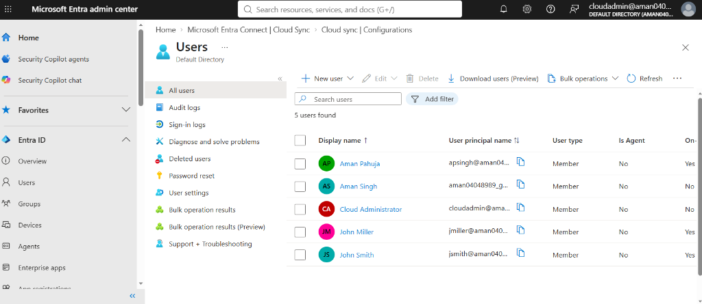

---

### Milestone 5: Password Hash Synchronization (PHS) Authentication Validation
* **Verification:** Performed end-to-end cloud authentication test at `https://myapps.microsoft.com` using the synchronized on-premises Active Directory password credentials.
* **Troubleshooting Handled:** Resolved initial hash synchronization queue delay by performing an AD password event and triggering an incremental delta sync (`Start-ADSyncSyncCycle -PolicyType Delta`). Documented in [Case Study 05](../troubleshooting/05_password_hash_sync_authentication.md).
* **Result:** User successfully authenticated and landed on the My Apps enterprise dashboard under active tenant session context.

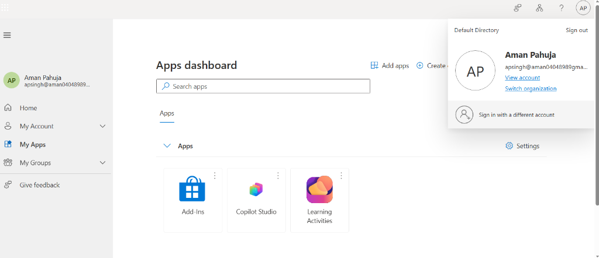

---

### Milestone 6: Seamless Single Sign-On (Seamless SSO) Endpoint Validation
* **Mechanism:** When Seamless SSO is enabled, Entra Connect creates a dedicated computer account (`AZUREADSSOACC`) in on-premises AD. Windows domain-joined endpoints query this SPN to obtain Kerberos service tickets for Microsoft's cloud login endpoints.
* **Client Configuration:** Added `https://autologon.microsoftazuread-sso.com` to the **Local Intranet Zone** on client endpoint `WS01`.
* **Testing:** Navigated to `https://myapps.microsoft.com` inside Microsoft Edge on `WS01` as user `CORP\apsingh`.
* **Result:** The browser silently negotiated authentication via Kerberos ticket exchange without prompting for user password input, signing straight into the enterprise dashboard.
* **Cryptographic Proof:** Executed `klist` in PowerShell on `WS01` confirming cached Kerberos service tickets for domain controller communication and cloud endpoint authentication.

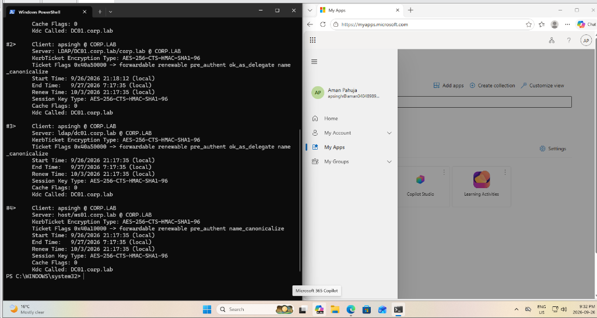

---

### Milestone 7: Departmental Security Group Provisioning
* **Objective:** Establish standard role- and department-based security groupings in on-premises Active Directory to support Access Control Lists (ACLs), file shares, and cloud licensing.
* **Naming Standard:** Followed standard enterprise conventions (`SG-<Department>`):
  * `SG-Corporate-Employees` (Global employee baseline)
  * `SG-Finance`
  * `SG-Human-Resources`
  * `SG-IT-Support`
* **Implementation:** Created the security groups within `OU=Employees,DC=corp,DC=lab` on `DC01`.

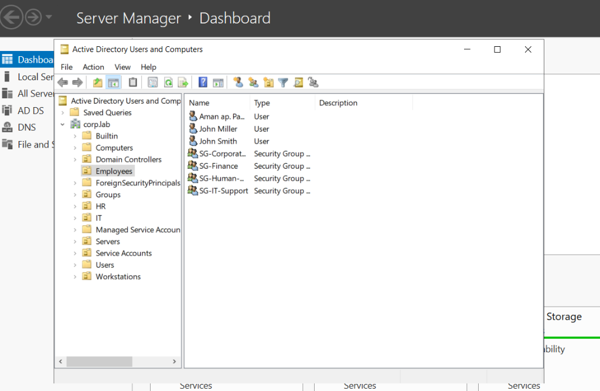

---

### Milestone 8: Directory Delta Synchronization & Cloud Verification
* **Sync Trigger:** Initiated an incremental delta synchronization cycle using PowerShell on `DC01`:
  ```powershell
  Start-ADSyncSyncCycle -PolicyType Delta
  ```
* **Cloud Portal Verification:** Navigated to Microsoft 365 admin center / Microsoft Entra admin center under `Groups > Active groups`.
* **Telemetry Proof:**
  * All four security groups (`SG-Corporate-Employees`, `SG-Finance`, `SG-Human-Resources`, `SG-IT-Support`) synchronized successfully.
  * Verified sync attribute: **`Sync status: Synced from on-premises`**.

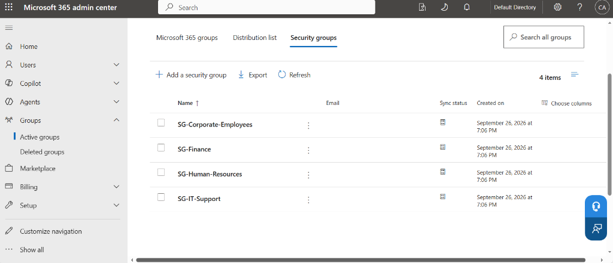

---

### Milestone 9: Scoped RBAC Role Assignment (Helpdesk Administrator)
* **Principle of Least Privilege (PoLP):** Rather than granting high-risk Global Administrator permissions across all staff, administrative privileges were strictly scoped to the user's operational role.
* **Role Scoping:** Assigned user `Aman Pahuja` (`CORP\apsingh`) the **Helpdesk Administrator** role within the Microsoft 365 / Entra admin center.
* **Separation of Duties:** Break-glass/emergency administration remains exclusively with the isolated cloud-only Global Administrator (`cloudadmin@aman04048989gmail.onmicrosoft.com`), while daily user and password administration is delegated to the Helpdesk Administrator.

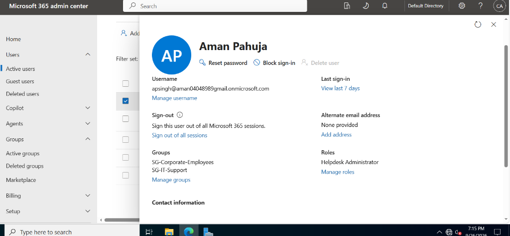

---

### Milestone 10: Least Privilege Boundary & Privilege Escalation Prevention Audit
* **Testing Methodology:** Signed into `https://admin.cloud.microsoft` inside a clean InPrivate browsing session using the scoped `Aman Pahuja` (Helpdesk Admin) account.
* **Privilege Escalation Test:** Navigated to role administration and attempted to edit administrative roles and assign the **Global Administrator** directory role.
* **Security Enforcement:** Microsoft Entra ID blocked the action at the directory API level, presenting the security boundary alert:
  > *"You don't have permission to save changes."*
* **Security Value:** Proves defense-in-depth and operational compliance; a compromised helpdesk account cannot elevate itself or grant tenant-wide administrative privileges.

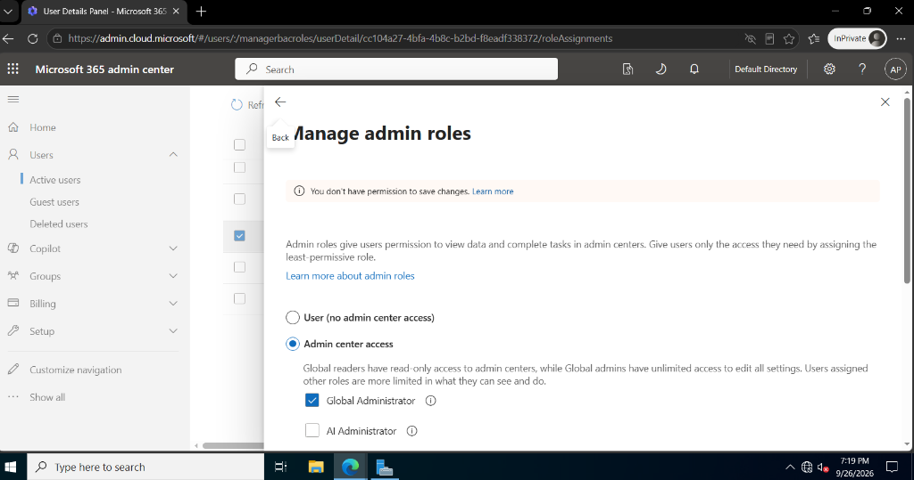

---

## 📊 Summary of Hybrid Identity & Access Outcomes
* ✅ On-Premises AD DS extended to Microsoft Entra ID with hybrid directory sync.
* ✅ Password Hash Synchronization verified and functional.
* ✅ Seamless Single Sign-On operational on Windows 11 endpoint (`WS01`).
* ✅ Departmental Security Groups (`SG-*`) provisioned and synchronized (`Synced from on-premises`).
* ✅ Role-Based Access Control (RBAC) operationalized with scoped `Helpdesk Administrator` delegation.
* ✅ Principle of Least Privilege (PoLP) tested and verified against unauthorized privilege escalation.
* ✅ Complete visual proof pipeline (Screenshots 01–12) validated.
